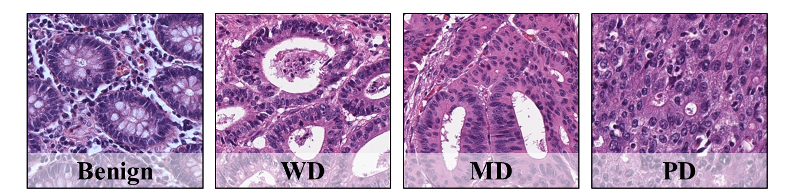

# KBSMC colon cancer grading dataset repository

This repository provides the KBSMC colon cancer grading dataset that has been introduced in the paper: 

Trinh Thi Le Vuong, Kyungeun Kim, Boram Song, Jin Tae Kwak,

"Joint Categorical and Ordinal Learning for Cancer Grading in Pathology Images", 

which is published in [Medical Image Analysis](https://www.sciencedirect.com/science/article/pii/S1361841521002516), 2021, 73. [(Code)](https://github.com/QuIIL/JCO_Learning-pytorch) <br />



## Download
Google drive:\
Training + validation + testing I: [[link]](https://drive.google.com/file/d/11Bd-QMk1ouDr2WwcFVIYHctqJAd6NKUT/view?usp=sharing) \
Testing II (Independent test set): [[link]](https://drive.google.com/file/d/10bJ-2kjIH7VZor-Hr7VeZGApMGrGCAI4/view?usp=sharing)

## Brief description
The tissue images and annotations are provided by Kangbuk Samsung Hospital, Seoul, South Korea. \
Two pathologists have delineated the annotation: Kim, Kyungeun, and Song, Boram.\
Herein, we obtained the benign (BN) and three cancer ROIs, including well-differentiated (WD) tumor, moderately-differentiated (MD) tumor, and poorly-differentiated (PD) tumor. 

- The train+val+test sets contain 3 whole slide images (WSIs) and 6 colorectal tissue microarrays (TMAs) from 340 patients that were scanned at 40x magnification using an Aperio digital slide scanner (Leica Biosystems). 

- The Test_set_2 (Independent test set) includes 45 WSIs from 45 patients scanned using a NanoZoomer digital slide scanner (Hamamatsu Photonics K.K.), at 40x magnification. 

- The patch images are generated at 40x of size (~258 &micro;m x 258 &micro;m), then resize to 512x512 pixels (20x).
For more detail, please refer to the paper above.


## Dataset detail
| **Status** | **Training** | **Validation** | **Testing I** | **Testing II** |
|------------|--------------|----------------|---------------|----------------|
| Benign     | 773          | 374            | 453           | 27986          |
| WD         | 1866         | 264            | 192           | 8394           |
| MD         | 2997         | 370            | 738           | 61985          |
| PD         | 1397         | 234            | 205           | 11895          |


## Training + validation + testing I  structure

├── KBSMC_colon_tma_cancer_grading_512 \
│ ├── tma01 \
│      │  ├── 100100_19493_**0**.jpg  \
│      │  ├── 100221_64120_**3**.jpg \
│      │  ├── 100383_42563_**2**.jpg \
│      │  ├── 100443_52718_**2**.jpg \
│      │  ├── 100634_14705_**1**.jpg \
│      │  ├── ... \
│ ├── tma02 \
│ ├── tma03 \
│ ├── tma04 \
│ ├── tma05 \
│ ├── tma06 \
│ ├── wsi01 \
│ ├── wsi02 \
│ └── wsi03 

### Notes:
Train+Val+Test 1
Class label is the last digit in image name (bolden), for example 100100_19493_**0**.jpg belongs to benign class.

Test 2
Class label is the (last digit-1) in image name (bolden), for example 100100_19493_**1**.jpg belongs to benign class.


## Simple way to load the dataset
Check out the dataset.py

```python
def prepare_colon_tma_data(data_root_dir='./KBSMC_colon_tma_cancer_grading_512'):
    """ List all the images and their labels 
        return Training + validation + testing I
    """
    def load_data_info(pathname):
        file_list = glob.glob(pathname)
        label_list = [int(file_path.split('_')[-1].split('.')[0]) for file_path in file_list]
        print(Counter(label_list))
        return list(zip(file_list, label_list))

    set_tma01 = load_data_info('%s/tma01/*.jpg' % data_root_dir)
    set_tma02 = load_data_info('%s/tma02/*.jpg' % data_root_dir)
    set_tma03 = load_data_info('%s/tma03/*.jpg' % data_root_dir)
    set_tma04 = load_data_info('%s/tma04/*.jpg' % data_root_dir)
    set_tma05 = load_data_info('%s/tma05/*.jpg' % data_root_dir)
    set_tma06 = load_data_info('%s/tma06/*.jpg' % data_root_dir)
    set_wsi01 = load_data_info('%s/wsi01/*.jpg' % data_root_dir)  # benign exclusively
    set_wsi02 = load_data_info('%s/wsi02/*.jpg' % data_root_dir)  # benign exclusively
    set_wsi03 = load_data_info('%s/wsi03/*.jpg' % data_root_dir)  # benign exclusively

    train_set = set_tma01 + set_tma02 + set_tma03 + set_tma05 + set_wsi01
    valid_set = set_tma06 + set_wsi03
    test_set = set_tma04 + set_wsi02

    return train_set, valid_set, test_set

def prepare_colon_wsi_data(data_root_dir='./KBSMC_colon_45wsis_cancer_grading_512 (Test 2)'):
        """ List all the images and their labels 
        return test_set 2
    """
    def load_data_info_from_list(data_dir, path_list):
        file_list = []
        for WSI_name in path_list:
            pathname = glob.glob(f'{data_dir}/{WSI_name}/*/*.png')
            file_list.extend(pathname)
            label_list = [int(file_path.split('_')[-1].split('.')[0]) -1 for file_path in file_list]
        print(Counter(label_list))
        list_out = list(zip(file_list, label_list))
        return list_out

    wsi_list = ['wsi_001', 'wsi_002', 'wsi_003', 'wsi_004', 'wsi_005', 'wsi_006', 'wsi_007', 'wsi_008', 'wsi_009',
                'wsi_010', 'wsi_011', 'wsi_012', 'wsi_013', 'wsi_014', 'wsi_015', 'wsi_016', 'wsi_017', 'wsi_018',
                'wsi_019', 'wsi_020', 'wsi_021', 'wsi_022', 'wsi_023', 'wsi_024', 'wsi_025', 'wsi_026', 'wsi_027',
                'wsi_028', 'wsi_029', 'wsi_030', 'wsi_031', 'wsi_032', 'wsi_033', 'wsi_034', 'wsi_035', 'wsi_090',
                'wsi_092', 'wsi_093', 'wsi_094', 'wsi_095', 'wsi_096', 'wsi_097', 'wsi_098', 'wsi_099', 'wsi_100']

    test_set = load_data_info_from_list(data_root_dir, wsi_list)
    return test_set


class DatasetSerial(data.Dataset):
    """get image by index
    """
    def __init__(self, pair_list, img_transform=None, target_transform=None, two_crop=False):
        self.pair_list = pair_list

        self.img_transform = img_transform
        self.target_transform = target_transform
        self.num = self.__len__()

    def __getitem__(self, index):
        """
        Args:
            index (int): index
        Returns:
            tuple: (image, index, ...)
        """
        path, target = self.pair_list[index]
        image = pil_loader(path)

        # # image
        if self.img_transform is not None:
            img = self.img_transform(image)
        else:
            img = image

        return img, target

```

# Citation
If any part of this dataset is used, please give appropriate citation to our paper.
<br />
```
@article{le2021joint,
  title={Joint categorical and ordinal learning for cancer grading in pathology images},
  author={Le Vuong, Trinh Thi and Kim, Kyungeun and Song, Boram and Kwak, Jin Tae},
  journal={Medical image analysis},
  pages={102206},
  year={2021},
  publisher={Elsevier}
}
```
